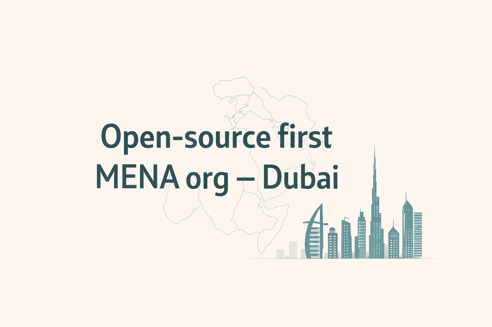
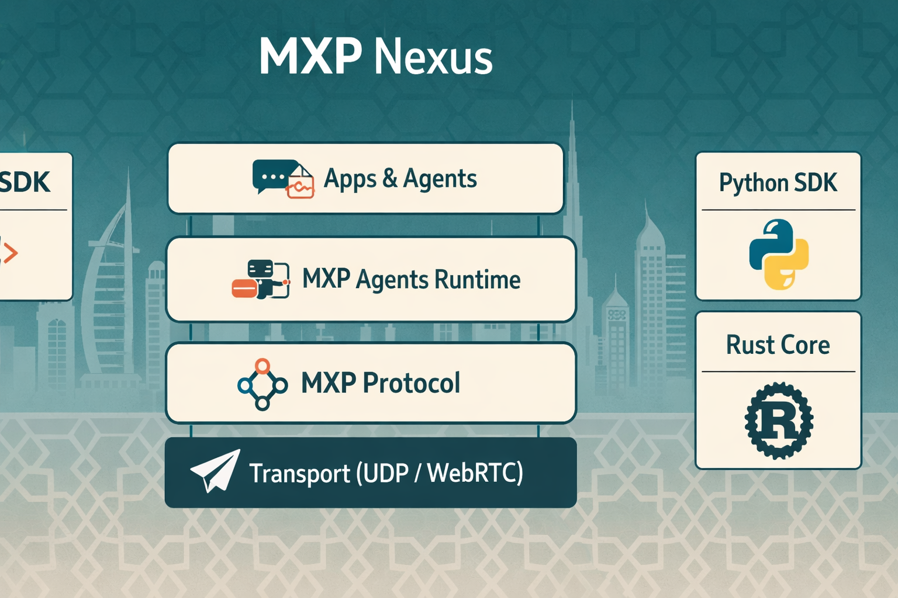
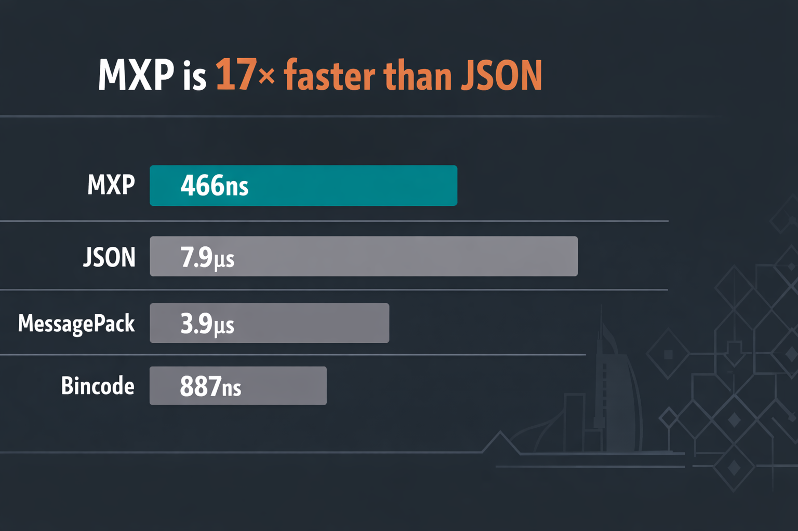

# MXP Nexus

Open-source first MENA organization based in Dubai, building the MXP protocol and runtime for AI agents.

## What we build

- MXP Protocol: https://github.com/yafatek/mxp-protocol
- MXP Agents Runtime: https://github.com/yafatek/mxp-agents-runtime
- MXP JS SDK: https://github.com/yafatek/mxp-js
- MXP Python SDK: https://github.com/yafatek/mxp-py
- Website and docs: https://getmxp.xyz

## Why MXP

- Protocol-first agent-to-agent communication.
- Production runtime with policy, tools, and telemetry.
- Cross-language interoperability.

## Architecture

## Performance

## Get involved

- Discussions: https://github.com/yafatek/mxp-protocol/discussions
- Contributing guide: https://github.com/yafatek/mxp-protocol/blob/main/CONTRIBUTING.md
